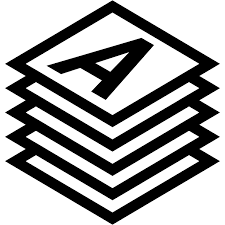

### Allmaps News

[Allmaps](https://allmaps.org) is a free and open-source platform for making digital map collections easier to share, use, and explore.

As part of a [Digital Humanities Advancement Grant](https://www.neh.gov/grants/odh/digital-humanities-advancement-grants), the [Leventhal Map & Education Center](https://leventhalmap.org) (LMEC) and the [American Geographical Society Library](https://uwm.edu/libraries/agsl/) (AGSL) are excited to work alongside a community of open-source software developers to make it easier for map-holding institutions to incorporate Allmaps into their collections. Not only will users and institutions be able to easily georeference maps online, but they’ll be able to crowdsource, create, and curate their own collections of maps across different collections.

[Subscribe to the LMEC General newsletter](https://www.leventhalmap.org/subscribe/) to stay tuned for the latest updates about the NEH-funded Allmaps project.

Read more about the award in the National Endowment for the Humanities' [recent press release](https://www.neh.gov/news/neh-announces-413-million-280-humanities-projects-nationwide).

<!--  -->
