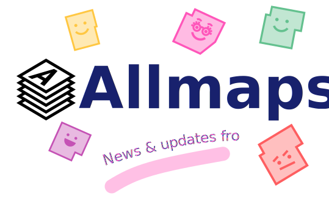

```js
import * as d3 from "npm:d3";
import confetti from "npm:canvas-confetti";
const background = await FileAttachment("assets/background-boston.jpg").href;
d3.select("body").style("background-image", "url(" + background + ")");
const img = document.getElementById("clickme");
img.addEventListener("click", (event) => {
  const rect = img.getBoundingClientRect();
  const x = rect.left + rect.width / 2;
  const y = rect.top + rect.height / 2;
  confetti({
    origin: { x: x / window.innerWidth, y: y / window.innerHeight },
    particleCount: 100,
    spread: 500,
  });
});
```
<div class="container">
  <hgroup class="hgroup">
    
    <span class="speech-bubble slim shake">November 18, 2024: Save the date for the<a href="/2024-convening"><b> Allmaps 2024 Fall Convening!</b></a></span>
  </hgroup>
</div>



<div class="hero">
  <h2>The <a href="https://leventhalmap.org" target="blank">Leventhal Map & Education Center (LMEC)</a> at the Boston Public Library and the <a href="https://uwm.edu/lib-collections/agsl-digital-map-collection/" target="blank">American Geographical Society Library (AGSL)</a> at the University of Wisconsin-Milwaukee are working with the <a href="https://allmaps.org" target="blank">Allmaps Project</a> to make digital tools like Allmaps more sustainable. </h2>
  <p>Allmaps makes it easier and more fun to georeference maps </p>
  <p><i>This work is funded by a National Endowment for the Humanities Digital Humanities Advancement Grant</i></p>
  <a href="/2024-convening">2024 Convening<span style="display: inline-block; margin-left: 0.25rem;">↗︎</span></a>
  <a href="/news">News & updates<span style="display: inline-block; margin-left: 0.25rem;">↗︎</span></a>
  <a href="/about-the-grant">About the grant<span style="display: inline-block; margin-left: 0.25rem;">↗︎</span></a>
  <a href="/stay-in-touch">Stay in touch<span style="display: inline-block; margin-left: 0.25rem;">↗︎</span></a>
</div>

<div class="grid grid-cols-4">
  <div class="card"><a href="https://leventhalmap.org"></a></div>
  <div class="card"><a href="https://www.tudelft.nl/"></a></div>
  <div class="card"><a href="https://www.neh.gov/grants/odh/digital-humanities-advancement-grants"></a></div>
  <div class="card"><a href="https://iiif.io/"></a></div>
</div>

<style>

body {
  background-repeat: no-repeat;
  background-size: cover;
  background-position: center;
}

#observablehq-center {
  margin: 0;
  padding: 1rem 2rem;
}

.banner {
  /* border-radius: 0.75rem; */
  /* border: solid 1px var(--theme-foreground); */
  width: 100%;
}

.logo {
  height: 50px;
}

.card {
  text-align: center;
  background: none;
}

.hero {
  display: flex;
  flex-direction: column;
  align-items: center;
  font-family: var(--sans-serif);
  margin: 0rem 0rem 4rem 0rem;
  text-wrap: balance;
  text-align: center;
  & a {
    font-weight: 500;
  }
}

.hero h1 {
  margin: 1rem 0;
  padding: 1rem 0;
  max-width: none;
  font-size: 14vw;
  font-weight: 900;
  line-height: 1;
  background: linear-gradient(30deg, var(--theme-foreground-focus), currentColor);
  -webkit-background-clip: text;
  -webkit-text-fill-color: transparent;
  background-clip: text;
}

.hero h2 {
  margin: 1rem;
  max-width: 34em;
  font-size: 20px;
  font-style: initial;
  font-weight: 500;
  line-height: 1.5;
  color: var(--theme-foreground-muted);
}

@media (min-width: 640px) {
  .hero h1 {
    font-size: 90px;
  }
}

</style>

<script
  type="module"
  src="https://unpkg.com/playhtml@latest/dist/init.es.js">
</script>