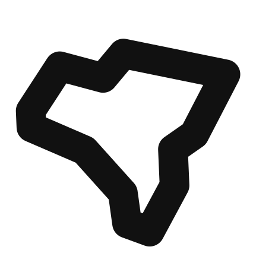
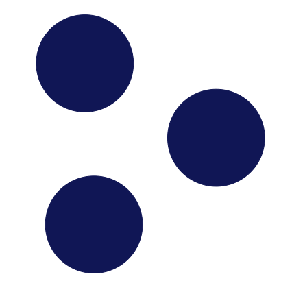

# What is Allmaps?

<a class="sticker" href="https://arcade.allmaps.org"></img></a>

</img>

<a href="https://github.com/allmaps/allmaps"></img></a> **Allmaps** is a lightweight open-source software ecosystem that makes [georeferencing](https://www.leventhalmap.org/projects/digital-projects/georeferencing/) map collections simpler, easier, and more fun. You can use Allmaps to overlay maps on top of one another entirely in a web browser, without downloading any software or large image files.

Allmaps consists of two main applications: [Allmaps Editor](https://editor.allmaps.org) and [Allmaps Viewer](https://viewer.allmaps.org). You can use Editor to georeference maps and use Viewer to display them.

## How it works

Allmaps loads maps with the <a href="https://iiif.io"></a> **The IIIF protocol**, a widely used framework for sharing deeply-zoomable, high-resolution images on the web. By loading maps that already exist on IIIF servers, Allmaps bypasses the computationally intensive and time-consuming steps of downloading and processing large image files (like TIFFs and GeoTIFFs).

Allmaps is built in [Svelte](https://svelte.dev/) and [TailwindCSS](https://tailwindcss.com/), and uses [IIIF](https://iiif.io/), [WebGL](https://developer.mozilla.org/en-US/docs/Web/API/WebGL_API), and [OpenLayers](https://openlayers.org/) to dynamically warp maps in the browser. See the [GitHub repository](https://github.com/allmaps/allmaps) for a full description of the Allmaps codebase.

## Georeference annotations

<a href="https://iiif.io/api/extension/georef/#3-web-annotations-for-georeferencing"></a> **Georeference annotations** make the magic happen. These lightweight `JSON` files contain all the information needed to georeference a map, including:

> ** masks**, which specify the parts of a map that should be displayed

> ** control points**, which correspond pixels in a map image with geographic coordinates in the real world
 
Georeference annotations are an approved data standard and conform to the [Web Annotation Data Model](https://www.w3.org/TR/annotation-model/). Check out a sample georeference annotation for [this map](https://collections.leventhalmap.org/search/commonwealth:3f463198b):

```json
{
  "type": "AnnotationPage",
  "@context": "http://www.w3.org/ns/anno.jsonld",
  "items": [
    {
      "id": "https://annotations.allmaps.org/maps/c26a8031255516aa",
      "type": "Annotation",
      "@context": [
        "http://iiif.io/api/extension/georef/1/context.json",
        "http://iiif.io/api/presentation/3/context.json"
      ],
      "created": "2024-06-25T14:12:18.596Z",
      "modified": "2024-06-25T14:12:18.596Z",
      "motivation": "georeferencing",
      "target": {
        "type": "SpecificResource",
        "source": {
          "id": "https://iiif.digitalcommonwealth.org/iiif/2/commonwealth:3f463c23b",
          "type": "ImageService2",
          "height": 5955,
          "width": 7707,
          "partOf": [
            {
              "id": "https://ark.digitalcommonwealth.org/ark:/50959/3f463198b/canvas/3f463c23b",
              "type": "Canvas",
              "label": {
                "none": [
                  "image 1"
                ]
              },
              "partOf": [
                {
                  "id": "https://ark.digitalcommonwealth.org/ark:/50959/3f463198b/manifest",
                  "type": "Manifest",
                  "label": {
                    "none": [
                      "Boston"
                    ]
                  }
                }
              ]
            }
          ]
        },
        "selector": {
          "type": "SvgSelector",
          "value": "<svg width=\"7707\" height=\"5955\"><polygon points=\"310,276 2603,254 4928,281 7430,285 7388,5801 5193,5713 2143,5749 268,5738\" /></svg>"
        }
      },
      "body": {
        "type": "FeatureCollection",
        "transformation": {
          "type": "polynomial",
          "options": {
            "order": 1
          }
        },
        "features": [
          {
            "type": "Feature",
            "properties": {
              "resourceCoords": [
                1568,
                1078.5
              ]
            },
            "geometry": {
              "type": "Point",
              "coordinates": [
                -71.0798495745,
                42.3710301214
              ]
            }
          },
          {
            "type": "Feature",
            "properties": {
              "resourceCoords": [
                5287,
                701.25
              ]
            },
            "geometry": {
              "type": "Point",
              "coordinates": [
                -71.0379159187,
                42.3790947392
              ]
            }
          },
          {
            "type": "Feature",
            "properties": {
              "resourceCoords": [
                1305.75,
                4525
              ]
            },
            "geometry": {
              "type": "Point",
              "coordinates": [
                -71.0765129065,
                42.3413227921
              ]
            }
          },
          {
            "type": "Feature",
            "properties": {
              "resourceCoords": [
                2729.5,
                2794.5
              ]
            },
            "geometry": {
              "type": "Point",
              "coordinates": [
                -71.0631984209,
                42.3577202471
              ]
            }
          },
          {
            "type": "Feature",
            "properties": {
              "resourceCoords": [
                3486.25,
                5010
              ]
            },
            "geometry": {
              "type": "Point",
              "coordinates": [
                -71.0508495306,
                42.3387771556
              ]
            }
          }
        ],
        "_allmaps": {
          "id": "https://annotations.allmaps.org/maps/c26a8031255516aa",
          "version": "https://annotations.allmaps.org/maps/c26a8031255516aa@6ffbc0e86518e599",
          "image": {
            "id": "https://annotations.allmaps.org/images/4b50c272cb45ca0f",
            "version": "https://annotations.allmaps.org/images/4b50c272cb45ca0f@2ae29dbea23ca2da",
            "canvases": [
              {
                "id": "https://annotations.allmaps.org/canvases/fc306a4ebfecb14f",
                "manifests": [
                  {
                    "id": "https://annotations.allmaps.org/manifests/cfb327e4b43395e3"
                  }
                ]
              }
            ]
          },
          "scale": 1.034986,
          "area": 36360362.94
        }
      }
    }
  ]
}
```

## Allmaps tools and experiments

**Core Allmaps tools:**
|  |  |
| :---- | -- |
| [Georeference Annotation](https://iiif.io/api/extension/georef/)                         | specification of the data format used by Allmaps.                                                                                                                                  |
| [Allmaps Editor](https://editor.allmaps.org/)                                            | georeference a map by entering the URL of a IIIF resource.                                                                                                                         |
| [Allmaps Viewer](https://viewer.allmaps.org/)                                            | view georeferenced maps by entering the URL of a Georeference Annotation.                                                                                                          |
| [Allmaps Latest](https://latest.allmaps.org)                                             | the latest maps georeferenced with Allmaps.                                                                                                                                        |
| [Allmaps CLI](https://github.com/allmaps/allmaps/tree/main/apps/cli)                     | command-line interface for Allmaps.                                                                                                                                                |
| [Allmaps Tile Server](https://observablehq.com/@allmaps/allmaps-tile-server)             | proxy server that generates an XYZ map tile layer from one or more Georeference Annotations. You can use the Allmaps Tile Server to display warped maps in applications like QGIS. |
| [GitHub](https://github.com/allmaps) and [Observable](https://observablehq.com/@allmaps) | More tools and experiments can be found.                                                                                                                                           |

**Allmaps experiments:**

|  |  |
|---------|-------------|
| [Allmaps Here](https://here.allmaps.org) | shows georeferenced maps around your current location. |
| [Allmaps Explore](https://explore.allmaps.org) | experimental interface for exploring all maps georeferenced with Allmaps, built with Protomaps. |
| [Allmaps Arcade](https://arcade.allmaps.org) | put the georeferenced maps back where they belong! |


<!-- <iframe loading="lazy" id="iframe" src="https://latest.allmaps.org" style="border:0px" width="640px" height="400px"></iframe> -->

<script
  type="module"
  src="https://unpkg.com/playhtml@latest/dist/init.es.js">
</script>